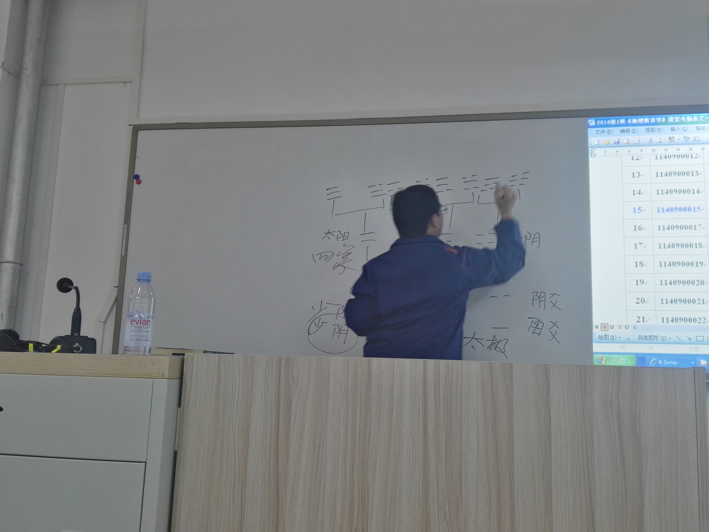

# what-remains---仍然留下的部分

What remains after loss: recovered images that preserve traces of time
遗失之后仍然留下的部分：被抢救回来的时代痕迹

## Featured / 展示

Shared Bike After Use / 使用之后的共享单车

Left after use, without anyone noticing.
使用之后被留下，没有人再注意它。

Chalk and Screen / 板书与屏幕

He kept writing even after the screen was already on.
屏幕已经打开，他仍然继续在黑板上书写。

---

What remains after loss: recovered images that preserve traces of time. This is not a photo collection. This is what remains. 遗失之后仍然留下的部分：被抢救回来的时代碎片

Origin / 来源
Many images in this archive were recovered from damaged storage.

Old hard drives were cleaned.
Files were lost.
Metadata disappeared.
Some images survived only by chance.

许多照片来自损坏硬盘的抢救恢复。

硬盘被清理过，
文件已经丢失，
EXIF信息消失，
有些只是偶然幸存。

This archive is not complete.
It is what remains.

这个档案并不完整。
它只是仍然留下的部分。

---
## Imperfection / 不完美

These images may be:

* taken with outdated devices
* underexposed or overexposed
* low resolution
* full of noise
* with incorrect or faded colors

这些照片可能：

* 来自老旧设备
* 曝光不足或过度
* 分辨率较低
* 噪点明显
* 色彩偏差

---

These are not flaws.

They are part of the record.

这并不是缺点，
而是记录的一部分。

---

In many cases,
imperfection preserves more than perfection.

很多时候，
不完美反而保留了更多真实。

---

## Scope / 范围

This archive is intentionally broad.

It may include:

* everyday street scenes
* temporary notices and signs
* classrooms and lectures
* buildings and spaces
* cultural and social activities
* interfaces and systems
* moments of attention

这个项目的收集范围是有意保持开放的。

可以包括：

* 街头日常
* 临时通知与告示
* 大学课堂与讲座
* 建筑与空间
* 文体与社会活动
* 系统与界面
* 注意力瞬间

---

However, not everything belongs here.

But they must share one condition:

they were not meant to be preserved,
yet they accidentally recorded something real.

但并不是所有内容都适合。

它们必须满足一个条件：

这些内容原本并非为了被拍摄保存，
却无意中记录了真实。

